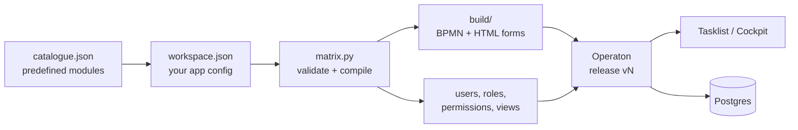

# Operaton Platform: Matrix BD prototype

Matrix BD's site lifecycle running on [Operaton](https://github.com/operaton/operaton) (open-source BPMN engine), built entirely from **configuration**:

- **Predefined nodes:** 10 Matrix modules (BD, LOI, Legal, Finance, Design, Project Excellence, Project, NSO, Launch, Financial closure), each with preset tasks, fields, roles and approval loops.
- **Configurable flow:** modules are joined by "starts after" rules; tasks, fields, decisions and rules are added through a configurator (CLI or MCP tools for an AI agent).
- **A compiler** turns the configuration into BPMN, task forms, users, roles, permissions and inbox views, and deploys them as a versioned release.
- **Role-scoped:** 15 demo users across all Matrix roles. Each person sees only their own work; the guest can look but not act.



**Docs**
- [docs/PLATFORM.md](docs/PLATFORM.md): Operaton's capabilities, architecture, per-client screens, multi-client versions, never losing data, config management, packages to build.
- [docs/HOW-OPERATON-WORKS.md](docs/HOW-OPERATON-WORKS.md): from JSON to a running workflow, what gets stored, every table and data type.
- [docs/prompt-to-process.html](docs/prompt-to-process.html): how an AI agent turns a plain-language brief into a running flow (open in a browser).

---

## Quick start

**Needs:** Docker (Docker Desktop or colima), Python 3.10+. [uv](https://docs.astral.sh/uv/) is only needed for the MCP server.

```bash
git clone https://github.com/Adityashandilya555/operaton-plat.git
cd operaton-plat
./start.sh                    # Postgres + Operaton, waits until ready (first run pulls images)
python3 matrix.py publish     # deploy the app, create users, roles, permissions and views
python3 matrix.py check       # optional: drive one site end to end as the real users
```

Then open **http://localhost:8080/operaton/app/tasklist/** and log in.

To stop: `docker stop matrix-operaton matrix-db`. To start again: `./start.sh`. Data is kept in the Docker volume `matrix-db-data`.

---

## Logins and passwords

> These credentials are for the **local demo only**. They work only on a machine running this stack. Change them (`python3 matrix.py reset` generates a new shared password, then run `publish`) before exposing the stack anywhere.

### Apps

| App | URL | For |
|---|---|---|
| Tasklist | http://localhost:8080/operaton/app/tasklist/ | Doing the work |
| Cockpit | http://localhost:8080/operaton/app/cockpit/ | Watching sites move through the diagrams (admin, guest, demo) |
| Admin | http://localhost:8080/operaton/app/admin/ | Users, groups, permissions (demo) |
| REST API | http://localhost:8080/engine-rest | Basic auth, any user below |

### Users

Every role user has the password **`Matrix-c7b5f9`** (set in `workspace.json`).

| Username | Password | Role | Does |
|---|---|---|---|
| `demo` | `demo` | Platform admin | Everything in Cockpit, Tasklist and Admin |
| `admin` | `Matrix-c7b5f9` | Business Admin | Finance, 2D, GFC, design, budget, QA, launch and closure approvals; Cockpit read access |
| `bdexec1` | `Matrix-c7b5f9` | BD Executive | Starts sites; site details, LOI, CA code, launch verdict, **only for sites they created** |
| `bdexec2` | `Matrix-c7b5f9` | BD Executive | Same, for their own sites |
| `bdsup` | `Matrix-c7b5f9` | BD Supervisor | Shortlist / approve / send back, change requests, launch verdict. Sites it creates skip draft review |
| `legalexec` | `Matrix-c7b5f9` | Legal Executive | DD checklist |
| `legalsup` | `Matrix-c7b5f9` | Legal Supervisor | DD verdict, change-request review, agreement, licensing |
| `designexec` | `Matrix-c7b5f9` | Design Executive | Recce, 2D, 3D, BOQ uploads |
| `designsup` | `Matrix-c7b5f9` | Design Supervisor | Allocates the design executive, reviews each upload |
| `peexec` | `Matrix-c7b5f9` | Project Excellence Executive | Fills the 11-head GFC budget |
| `pesup` | `Matrix-c7b5f9` | Project Excellence Supervisor | Assigns the budget owner, reviews the budget |
| `projexec` | `Matrix-c7b5f9` | Project Executive | Execution milestones, quality audit, closure actuals |
| `projsup` | `Matrix-c7b5f9` | Project Supervisor | Allocation, reviews, NSO handover, NSO project sign-off |
| `nsoexec` | `Matrix-c7b5f9` | NSO Executive | Launch comms, readiness checks |
| `nsosup` | `Matrix-c7b5f9` | NSO Supervisor | NSO sign-off, launch-ready approval |
| `guest` | `Matrix-c7b5f9` | Observer | Read-only Cockpit; cannot act on any task |

### Database

| | |
|---|---|
| Host / port | `localhost:5433` (inside Docker: `matrix-db:5432`) |
| Database | `operaton` |
| User / password | `operaton` / `operaton` |

```bash
docker exec -it matrix-db psql -U operaton -d operaton
```

---

## Walk one site through

All three apps share one login session, so use a private window if you want Cockpit open as another user.

1. **`bdexec1`** → **Start process** → *Matrix BD - Site lifecycle* → fill the form → **Start**. Your list stays empty: the site is with the supervisor.
2. **`bdsup`** → **Team queue** → *Review site draft* → **Claim** → Decision *Shortlist* → **Complete**.
3. **`bdexec1`** → **My tasks** → *Submit site details* (numbers + a file) → **Complete**.
4. **`bdsup`** → *Approve site details*: everything entered so far is shown, with the file as a link. Try **Send back**, then approve.
5. **`bdexec1`** → *Upload LOI*; **`bdsup`** → *Send to Legal and Finance*.
6. Legal (`legalexec`, `legalsup`) and Finance (`bdexec1`, `bdsup`, `admin`) now run **in parallel**. Design opens only when both are done.
7. Continue: Design → Project Excellence → Project → NSO → Launch → Financial closure.

Watch it in **Cockpit** (as `admin` or `demo`): Processes → *Matrix BD - Site lifecycle* → pick a site to see where it is and its `stage` / `m_<module>` status variables.

---

## Repository

| Path | What |
|---|---|
| `catalogue.json` | Predefined nodes: the 10 Matrix modules with tasks, fields, roles, outcomes; default users, roles and views |
| `workspace.json` | The live app configuration (start: `python3 matrix.py reset` copies the catalogue). Holds the demo passwords |
| `matrix.py` | Validator, compiler (BPMN + forms), deploy, identity/permission/view sync, migration, end-to-end check, configurator ops |
| `mcp_server.py` | The configurator as MCP tools for an AI agent |
| `.mcp.json` | Registers the MCP server for Claude Code opened in this folder |
| `start.sh` | Starts Postgres 17 and Operaton 2.1.5 with authorization and REST login turned on |
| `build/` | Generated output of the last publish: 11 BPMN files and 55 HTML forms (regenerated on every publish) |
| `docs/` | Design and how-it-works documents |

## Configurator

CLI: `python3 matrix.py <op> '<json args>'`. The same operations are MCP tools in `mcp_server.py`.

| Op | Example |
|---|---|
| `show` | `python3 matrix.py show` |
| `catalogue` | list predefined modules |
| `add_module` | `'{"key": "legal2", "from_catalogue": "legal", "after": ["bd_loi"]}'` |
| `set_after` | `'{"key": "design", "after": ["legal", "finance"]}'` |
| `add_task` | `'{"module": "finance", "task": {"id": "fin_cfo", "name": "CFO approval", "role": "businessAdmin", "kind": "approval", "send_back": "fin_ca_entry"}, "before": "fin_admin"}'` |
| `update_task` / `remove_task` | `'{"module": "legal", "task_id": "legal_dd_verdict", "changes": {...}}'` |
| `add_field` | `'{"module": "bd_qualification", "task_id": "bd_site_details", "field": {"id": "footfall", "label": "Daily footfall", "type": "number"}}'` |
| `add_group` / `add_user` / `remove_user` | `'{"id": "cfo1", "name": "Rahul CFO", "groups": ["businessAdmin"]}'` |
| `add_view` | Tasklist view with columns and audience |
| `publish` | validate, compile, deploy a new release, sync users/roles/views |
| `migrate_running` | move running sites to the latest release |
| `start_case` / `case_status` | `'{"user": "bdexec1", "values": {"siteName": "Koramangala", "city": "Bengaluru", "address": "-", "storeModel": "Kiosk"}}'` |
| `reset` | restore the Matrix defaults from the catalogue (new password) |

Task shape: `{id, name, role, assignee?: "initiator" | <user field>, kind?: "approval", send_back?, allow_reject?, fields?, show?, outcomes?: [{id, label, to?}], route?: [{when, to}], skip_if?}`.
Field types: `text`, `textarea`, `number`, `date`, `boolean`, `select`, `user`, `file`.
`"after": ["a", "b"]` on a module means it starts when **all** of them are done.

### MCP (Claude Code)

Open Claude Code in this folder and approve the `matrix-configurator` server from `.mcp.json`. It runs `uv run --with "mcp<2" python mcp_server.py`. Then describe a change in plain language and ask Claude to apply and publish it.

---

## Troubleshooting

| Problem | Fix |
|---|---|
| "Login failed" | Check the username spelling (`bdexec1`, not `bdexect1`) and the password from the table above |
| A form looks old after a publish | Reload the page. Running sites keep their release until `python3 matrix.py migrate_running` |
| Team queue count shows 0 but tasks exist | Click the view to refresh it |
| Port 8080 or 5433 already in use | Stop the other service, or edit the ports in `start.sh` |
| Start over completely | `docker rm -f matrix-operaton matrix-db && docker volume rm matrix-db-data && ./start.sh && python3 matrix.py publish` |

## Known limitations (prototype)

- One client only; multi-client (tenants) is designed in [docs/PLATFORM.md §5](docs/PLATFORM.md#5-many-clients-each-with-its-own-workflow-versions).
- Screens are Operaton's Tasklist and Cockpit; role dashboards and KPIs need the planned React app.
- Uploaded files are stored inside Postgres; production should use object storage.
- Processes carry a 180-day history time-to-live, but no cleanup job is scheduled, so nothing is deleted. See [docs/PLATFORM.md §6](docs/PLATFORM.md#6-never-losing-data) before production.
- Sites started from Tasklist have no business key; identify them by `siteName`.
