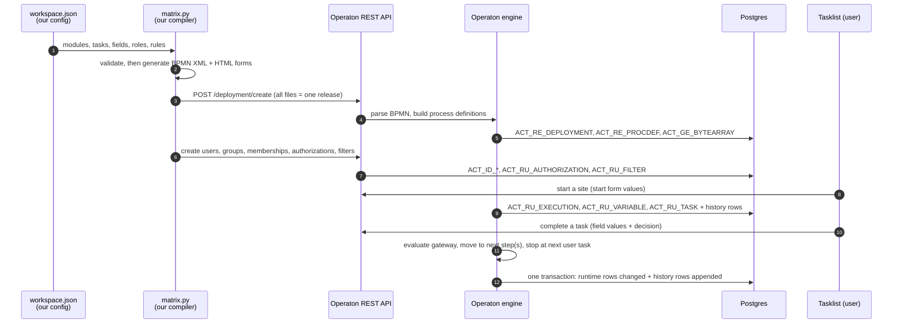

# How Operaton works: from JSON to a running workflow

This document follows one configuration change all the way down: from our JSON, through the BPMN we generate, into Operaton, and into the rows Operaton writes to Postgres. Every example below is taken from this repository's demo and its live database (Operaton 2.1.5 on Postgres 17).

---

## 1. The whole loop on one page



The key idea: **Operaton never sees our JSON.** It only understands BPMN 2.0 XML (the standard process notation), plus forms, users and permissions sent through its REST API. Our compiler is the translator.

---

## 2. Step 1: what we write (JSON)

A task in `workspace.json`:

```json
{
  "id": "bd_approve_details",
  "name": "Approve site details",
  "role": "bdSupervisor",
  "kind": "approval",
  "show": ["storeModel", "carpetArea", "frontageFt", "monthlyRent", "nearestCompetitorM", "sitePhotos"],
  "outcomes": [
    {"id": "approve",   "label": "Approve"},
    {"id": "send_back", "label": "Send back", "to": "bd_site_details"},
    {"id": "reject",    "label": "Reject",    "to": "@close"},
    {"id": "archive",   "label": "Archive",   "to": "@close"}
  ]
}
```

A module groups tasks in order and says what must finish before it starts:

```json
{ "key": "design", "name": "Design", "after": ["legal", "finance"], "tasks": [ ... ] }
```

Before anything is generated, `validate()` rejects configurations that could never run: a role with no users, an outcome pointing at a task that doesn't exist, a cycle between modules, an unknown field type, a `show` field nobody fills in.

---

## 3. Step 2: what the compiler generates (BPMN + forms)

### 3.1 One BPMN file per module, plus one for the whole site

| JSON | Generated BPMN element | Engine behaviour |
|---|---|---|
| task with `role` | `<userTask operaton:candidateGroups="bdSupervisor">` | Task appears in that group's queue |
| task with `assignee: "initiator"` | `<userTask operaton:assignee="${initiator}">` | Task goes only to whoever started the site |
| `outcomes` | `<exclusiveGateway>` + one `<sequenceFlow>` per outcome with a condition | Engine follows the one flow whose condition is true |
| `to: "@close"` | `<endEvent>` with `<errorEventDefinition errorRef="CLOSED">` | Stops the module and closes the site |
| `skip_if` | an `<exclusiveGateway>` before the task | Task is bypassed when the rule is true |
| `route` | conditions on flows after the task | Automatic rule, e.g. "loop until all licences cleared" |
| `{"parallel": [...]}` | `<parallelGateway>` split and join | Both tasks open at once; continue when both are done |
| module | its own `<process>` | Reusable sub-flow |
| module `after: [a, b]` | `<parallelGateway>` join before `<callActivity>` | Starts only when a **and** b are finished |
| two modules after the same one | `<parallelGateway>` split | Run side by side (Legal and Finance) |

Real output for the task above (`build/matrix_site__bd_qualification.bpmn`):

```xml
<bpmn:userTask id="bd_approve_details" name="Approve site details"
    operaton:formKey="embedded:deployment:forms/bd_approve_details.html"
    operaton:candidateGroups="bdSupervisor">

<bpmn:sequenceFlow sourceRef="bd_approve_details_gw" targetRef="done" name="Approve">
  <bpmn:conditionExpression>${bd_approve_details_outcome == 'approve'}</bpmn:conditionExpression>
</bpmn:sequenceFlow>
<bpmn:sequenceFlow sourceRef="bd_approve_details_gw" targetRef="bd_site_details" name="Send back">
  <bpmn:conditionExpression>${bd_approve_details_outcome == 'send_back'}</bpmn:conditionExpression>
</bpmn:sequenceFlow>
```

`${...}` is **JUEL**, a small expression language the engine evaluates against the case's variables. `bd_approve_details_outcome` is the value the supervisor picked in the form.

The site-level process calls each module and records progress (`build/matrix_site.bpmn`):

```xml
<bpmn:parallelGateway id="join_design" />
<bpmn:callActivity id="call_design" name="Design" calledElement="matrix_site__design"
    operaton:calledElementBinding="deployment">
  <bpmn:extensionElements>
    <operaton:executionListener event="start" expression="${execution.setVariable('stage', 'Design')}" />
    <operaton:executionListener event="start" expression="${execution.setVariable('m_design', 'in progress')}" />
    <operaton:executionListener event="end"   expression="${execution.setVariable('m_design', 'done')}" />
    <operaton:in businessKey="#{execution.processBusinessKey}" />
    <operaton:in variables="all" />
    <operaton:out variables="all" />
  </bpmn:extensionElements>
</bpmn:callActivity>
```

- `calledElementBinding="deployment"` pins a running site to the **same release** for every module it enters later. A site started on version 3 keeps using version 3's modules even after version 4 is published.
- `in variables="all"` copies everything entered so far into the module, which is how Design can show what BD entered. `out variables="all"` copies the module's data back when it finishes.
- The listeners maintain `stage` and `m_<module>`, the status of every department for every site.

Each diagram also gets layout coordinates (`<bpmndi:...>`), so Cockpit can draw it.

### 3.2 One HTML form per task

Operaton renders "embedded forms": plain HTML in which special attributes bind inputs to case variables. Real output (`build/forms/bd_site_details.html`, shortened):

```html
<input type="number" cam-variable-name="monthlyRent" cam-variable-type="Double" required>
<input type="file"   cam-variable-name="sitePhotos"  cam-variable-type="File" cam-max-filesize="10000000">
<script cam-script type="text/form-script">
  // loads earlier values (siteName, city, …) and shows them read-only in the "Site data" box
</script>
```

| Field type in JSON | HTML input | Stored as |
|---|---|---|
| `text`, `textarea`, `date` | text box, text area, date picker | `String` |
| `number` | number box | `Double` |
| `boolean` | checkbox | `Boolean` |
| `select`, `user` | dropdown (a `user` field lists the people in a group) | `String` |
| `file` | file picker | `File` |
| decision (`outcomes`) | dropdown `<task>_outcome` | `String` |

---

## 4. Step 3: deploying a release

`python3 matrix.py publish` sends every BPMN file and every form in **one** multipart request to `POST /engine-rest/deployment/create`, with `enable-duplicate-filtering=true`.

Inside one database transaction, the engine:

1. Compares the files with the last deployment of the same name. If nothing changed, it stops; no new version.
2. Writes a row to **`ACT_RE_DEPLOYMENT`** (the release).
3. Stores every file, byte for byte, in **`ACT_GE_BYTEARRAY`** (BPMN 23 KB, each form about 2 KB).
4. Parses each BPMN into a **process definition** in **`ACT_RE_PROCDEF`**, with `key` (e.g. `matrix_site__legal`) and the next `version` number for that key.
5. Caches the parsed model in memory, so executing a step does not re-read XML.

Deployments are **immutable**. Changing a form means publishing a new release. In the demo, three publishes produced versions 1, 2 and 3 of all 11 processes, so 33 definitions:

```
     key_          | version_
 matrix_site       |        1
 matrix_site       |        2
 matrix_site       |        3
 matrix_site__legal|        1 …
```

The same publish also syncs identity and access through REST: users, groups, memberships, **authorizations** (who may open which app, start which process, read which task) and **filters** (the saved Tasklist views such as "My tasks" and "Team queue").

---

## 5. Step 4: running a case

### Starting a site

A BD executive submits the start form, and the engine:

- creates the **process instance**: a row in `ACT_RU_EXECUTION`. An execution is a pointer to "where we are"; parallel branches get one execution each.
- stores the starter's user id in the variable `initiator` (from `operaton:initiator="initiator"` on the start event).
- writes the start-form values to `ACT_RU_VARIABLE`.
- moves forward through every step that needs no human (gateways, listeners) until it reaches a **wait state**, here the first user task.
- enters a module through `callActivity`, which creates a **child process instance** linked to its parent (`super_exec_`).

### A task waiting for someone

- `ACT_RU_TASK`: the task, with `assignee_` (one person) or none (a group queue).
- `ACT_RU_IDENTITYLINK`: candidate group or user links, e.g. `bdSupervisor`.
- `ACT_RU_AUTHORIZATION`: the engine adds task permissions for the assignee and candidates automatically. This is how a stranger is prevented from opening it.

### Completing a task

When the user presses **Complete**, everything below happens in **one** transaction:

1. The engine checks permissions (the user must be the assignee or a candidate, or hold a task grant).
2. The form values become variables (`ACT_RU_VARIABLE`).
3. The task row is removed from `ACT_RU_TASK`, and its history row is closed (`ACT_HI_TASKINST.end_time_`).
4. The engine evaluates the gateway's conditions and follows the matching flow.
5. It keeps going (gateways, joins, module start/end, listeners) until every path reaches the next wait state.
6. Every step taken is written to history (`ACT_HI_ACTINST`), every changed value to `ACT_HI_DETAIL`.
7. Commit. If anything fails, everything rolls back and the task is still there. A half-done step cannot exist.

If two people complete conflicting things at the same instant, row versions (`rev_`) detect it and one of them gets an error instead of silently overwriting the other ("optimistic locking").

### Finishing

When the last path reaches an end event, the runtime rows (`ACT_RU_*`) for that case are deleted. **History rows stay.** Everything about a finished site lives in `ACT_HI_*`.

---

## 6. The database: all 49 tables

Operaton's tables use a two-letter group prefix. Counts are from the demo after a few test sites.

| Prefix | Meaning | Main tables (rows in demo) |
|---|---|---|
| `ACT_GE_` | General: binary storage, engine settings | `bytearray` (476: every BPMN, form and uploaded file), `property` (9: schema version, history level) |
| `ACT_RE_` | Repository: what is deployed | `deployment` (3 releases), `procdef` (33 process versions), `decision_def` (DMN tables, 0), `camformdef` (JSON forms, 0) |
| `ACT_RU_` | Runtime: only what is in flight right now | `execution` (10), `task` (3), `variable` (88), `identitylink` (8), `authorization` (91), `filter` (4), `job` (timers and retries, 0), `incident` (failures, 0), `ext_task` (external workers, 0) |
| `ACT_HI_` | History: everything that ever happened | `procinst` (25 cases and modules), `actinst` (986 steps), `taskinst` (478 tasks), `varinst` (951 latest values), `detail` (2,200 individual value changes), `identitylink` (490), `op_log` (849 user operations: completes, user edits, permission changes) |
| `ACT_ID_` | Identity | `user` (16), `group` (15), `membership` (16), `tenant` (0), `tenant_member` (0) |

Case-management (`*_case_*`, CMMN), batch, decision-history and attachment/comment tables exist but are unused in this demo.

---

## 7. How values are stored

Every variable is one row with a type and a set of value columns. Only the column that fits the type is filled. Real rows from the demo:

| Type | Example | `TEXT_` | `TEXT2_` | `DOUBLE_` | `LONG_` | `BYTEARRAY_ID_` |
|---|---|---|---|---|---|---|
| `string` | `bd_review_draft_outcome` | `shortlist` | | | | |
| `string` (a date) | `loiSignedOn` | `2026-10-02` | | | | |
| `double` | `carpetArea` | | | `1450` | | |
| `boolean` | `ddPropertyTax` | | | | `1` (true) / `0` | |
| `file` | `sitePhotos` | `indiranagar-photos.txt` (filename) | `text/plain#` (MIME type, encoding) | | | → bytes in `ACT_GE_BYTEARRAY` |
| `long`, `integer` | (not used yet) | | | | the number | |
| `date` | (not used yet; we store ISO strings) | | | | epoch milliseconds | |
| `json` / `object` | (not used yet) | type name | data format | | | → serialized value |

Type counts across the demo's history: 553 strings, 173 doubles, 122 booleans, 103 files.

Points to know:
- **String limit:** `TEXT_` is `varchar(4000)`. Longer text must be stored as a JSON/object or file variable.
- **Files live inside the database**, as `bytea` in `ACT_GE_BYTEARRAY`. Fine for a demo, heavy at scale. In production they should go to object storage (e.g. Supabase Storage), keeping only a link in the case.
- **Runtime vs. history:** `ACT_RU_VARIABLE` holds the current value while the case runs; `ACT_HI_VARINST` holds the latest value forever; `ACT_HI_DETAIL` holds **every** value ever set, with time and step. That third one is what you need for audits ("what was the rent before the send-back?").

---

## 8. Identity, passwords and permissions

| What | Where | How |
|---|---|---|
| Users | `ACT_ID_USER` | Passwords stored as salted SHA-512 (`pwd_` is 97 characters, plus a separate `salt_`); never in plain text |
| Groups (roles) | `ACT_ID_GROUP` | `bdSupervisor`, `legalExecutive`, … IDs must be letters and digits only |
| Who is in which group | `ACT_ID_MEMBERSHIP` | |
| Clients (tenants) | `ACT_ID_TENANT`, `ACT_ID_TENANT_MEMBER` | Not used yet; see `PLATFORM.md` §5 |
| Permissions | `ACT_RU_AUTHORIZATION` | One row per grant: user or group, resource type, resource id, permission bits |

Resource types used by the demo's authorizations: 0 = application (Tasklist/Cockpit/Admin), 1 = user, 2 = group, 5 = filter, 6 = process definition, 7 = task, 8 = process instance, 9 = deployment, and so on up to 21.

The demo turns on authorization checks (`OPERATON_BPM_AUTHORIZATION_ENABLED=true`) and REST login (`OPERATON_BPM_RUN_AUTH_ENABLED=true`). Without them Operaton Run lets anyone do anything.

---

## 9. History: what is kept, and when it could be deleted

- **History level** is set engine-wide. The demo runs at `full` (`historyLevel = 3` in `ACT_GE_PROPERTY`), which records every step, every task and **every value change**. The lower levels (`audit`, `activity`, `none`) record less.
- **Time to live:** the compiler currently stamps `historyTimeToLive="180"` (days) on every process, because Operaton refuses deployments without one by default. As a result, finished cases get a `removal_time_` (466 of 478 history task rows already have one).
- **Cleanup only runs if scheduled.** History cleanup is a job that runs only when a cleanup window is configured. None is configured in the demo (`ACT_RU_JOB` is empty), so **nothing has been or will be deleted**. For production, remove the risk entirely, as described in `PLATFORM.md` §6.

---

## 10. Reading it back with SQL

Operaton's tables are plain Postgres, so reports can be written as views. These run against the demo database (sites started from Tasklist have no business key, so the site is identified by its `siteName` variable):

**Event log: who did what, when, and what they decided**
```sql
select t.end_time_  as at,
       t.assignee_  as who,
       t.name_      as task,
       (select d.text_ from act_hi_detail d
         where d.act_inst_id_ = t.act_inst_id_
           and d.name_ = t.task_def_key_ || '_outcome' limit 1) as decision
from act_hi_taskinst t
where t.end_time_ is not null
order by t.end_time_ desc;
```

**Status board: every site, every department**
```sql
select max(v.text_) filter (where v.name_ = 'siteName') as site,
       max(v.text_) filter (where v.name_ = 'stage')    as stage,
       max(v.text_) filter (where v.name_ = 'm_legal')   as legal,
       max(v.text_) filter (where v.name_ = 'm_finance') as finance,
       max(v.text_) filter (where v.name_ = 'm_design')  as design
from act_hi_procinst p
join act_hi_varinst v on v.proc_inst_id_ = p.id_
where p.proc_def_key_ = 'matrix_site'
group by p.id_;
```

**KPI: average time spent in each module**
```sql
select a.act_name_ as module, count(*) as runs,
       round(avg(a.duration_) / 3600000.0, 1) as avg_hours
from act_hi_actinst a
where a.act_type_ = 'callActivity' and a.end_time_ is not null
group by 1 order by 1;
```

The same data is available through the REST API (`/history/task`, `/history/variable-instance`, `/history/activity-instance`, `/history/detail`) and in Cockpit.

---

## 11. What Operaton does not do for us

- It does not know what a "site", "budget" or "LOI" is: it only stores named values per case.
- It cannot aggregate across cases (pipelines, KPIs) except through SQL on its tables.
- Its screens (Tasklist, Cockpit, Admin) are generic and branded once per installation.
- It never reads our JSON. If the compiler or validator has a bug, the engine faithfully runs the wrong flow. That's why `python3 matrix.py check` exists.
