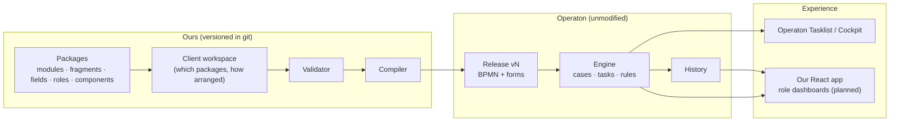
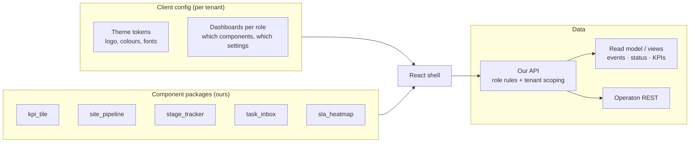
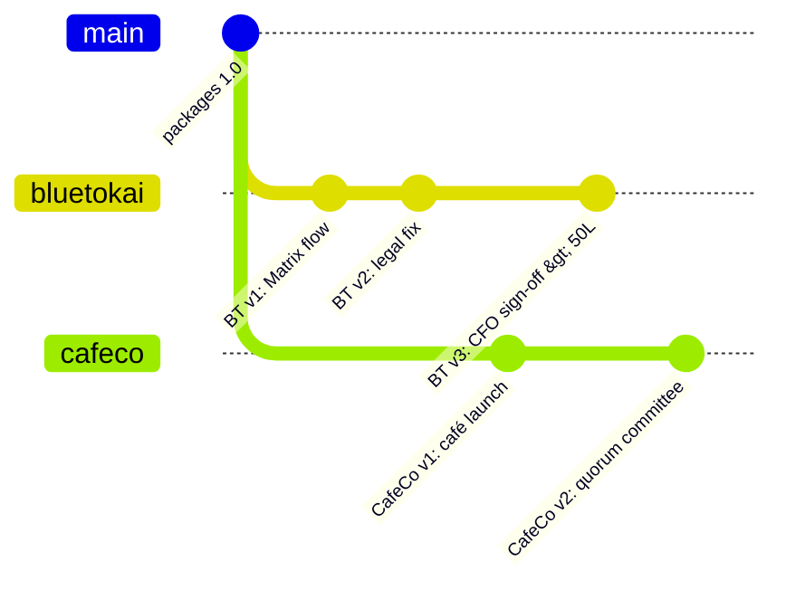
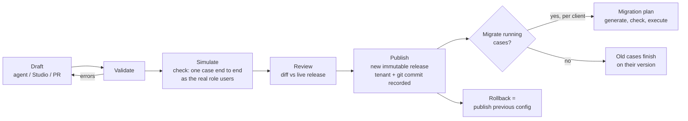

# Matrix Platform on Operaton

**Capabilities, architecture and operating model for a configurable, multi-client workflow platform.**

Status: prototype running (this repository). Design follows *Matrix Platform Refoundation* (Flow Graph compiled to BPMN, Operaton as the engine). Items are marked **Built** (works in this repo today) or **Planned**.

---

## Contents

1. [Summary](#1-summary)
2. [What Operaton is and what it gives us](#2-what-operaton-is-and-what-it-gives-us)
3. [How the platform works](#3-how-the-platform-works)
4. [Separate views and screens for each client and role](#4-separate-views-and-screens-for-each-client-and-role)
5. [Many clients, each with its own workflow versions](#5-many-clients-each-with-its-own-workflow-versions)
6. [Never losing data](#6-never-losing-data)
7. [Configuration management](#7-configuration-management)
8. [Packages we will write](#8-packages-we-will-write)
9. [Agent-driven configuration](#9-agent-driven-configuration)
10. [Roadmap and open decisions](#10-roadmap-and-open-decisions)

---

## 1. Summary

- **Operaton runs the work.** It decides what happens next, who must do it, enforces permissions, and records everything. It is open source (Apache 2.0), Camunda 7 compatible, and used unmodified.
- **We own the meaning.** Clients' processes are written as **configuration** (JSON) built from **packages** we maintain: modules with preset tasks, fields, approval patterns, roles, screens.
- **A compiler connects the two.** It validates a client's configuration and turns it into standard BPMN, forms, users and permissions, then deploys them as an immutable **release**.
- **Each client is isolated** by tenant, with its own releases and version history. Running cases stay on the version they started with.
- **Nothing is lost.** Every change is transactional, history is kept at full detail and never cleaned up, files move to object storage, and backups allow point-in-time restore.



---

## 2. What Operaton is and what it gives us

Operaton is a BPMN 2.0 process engine that runs inside the JVM, stores its state in a relational database, and exposes a REST API plus three web apps. It is the community continuation of Camunda 7: same REST API, database schema and model format.

### 2.1 Capabilities we use or will use

| Capability | What it means for Matrix | Status |
|---|---|---|
| **BPMN 2.0 execution** | Tasks, decisions, parallel work, loops, sub-flows, all from a standard diagram format | Built |
| User tasks with **assignee / candidate groups** | "Only the site's executive" or "any BD supervisor" | Built |
| **Exclusive and parallel gateways** | Approve / send back / reject; Legal ∥ Finance then join | Built |
| **Call activities** (sub-processes) | Each department module is a reusable process | Built |
| **Execution listeners + JUEL expressions** | Maintain each site's stage and department status; rules like "skip if created by a supervisor" | Built |
| **Versioned deployments** | Every publish is a new version; running sites keep theirs | Built |
| **Process instance migration** | Move running sites to a new version when a fix must apply | Built (`migrate_running`) |
| **Authorizations** | Who can open which app, start which process, see and complete which task | Built |
| **Identity** (users, groups, memberships) | Roles per department | Built |
| **Embedded HTML forms** | Generated per task from config, including file upload | Built |
| **Tasklist filters** | Saved views per role: "My tasks", "Team queue", "Admin approvals" | Built |
| **Full history + user operation log** | Every step, task, value change and admin action recorded | Built |
| **REST API** | Everything above is driven from Python; any frontend can use it | Built |
| **Multi-tenancy** | One engine, many clients, each with its own definitions and data | Planned (§5) |
| **Multi-instance tasks** | Quorum approvals ("2 of 3 committee members") | Planned |
| **DMN decision tables** | Delegation of authority by amount, routing by city or format | Planned |
| **Boundary timers** | SLA reminders and escalation | Planned |
| **External tasks** | Our Python/AI workers do system steps (ERP push, document generation, AI review) with retries | Planned |
| **Incidents and retries** | Failed automatic steps are parked visibly, never lost | Planned (with external tasks) |
| **Camunda Forms (form-js JSON)** | JSON-schema forms as an alternative to HTML (`ACT_RE_CAMFORMDEF` exists) | Optional |
| **Identity plugins (LDAP, Keycloak)** | Single sign-on with a client's directory | Planned |
| **Clustering** | Several engine nodes share one database; the job executor shares timers across them | Later, for scale |
| **Databases** | H2, PostgreSQL, MySQL, MariaDB, Oracle, SQL Server, DB2 | Using PostgreSQL |

### 2.2 What Operaton does not give us

| Gap | Who fills it |
|---|---|
| Business-friendly authoring (BPMN is too detailed for admins) | Our config model, compiler, and an agent or Studio |
| Domain meaning: "site", "budget", "LOI" | Our packages |
| Cross-case reporting: pipelines, KPIs, status boards | SQL views on its history tables, our read model (§4.3) |
| Branded, role-specific screens per client | Our React app (§4) |
| Field-level visibility, row-level rules outside tasks | Our API / Postgres row-level security |
| Large file storage | Object storage (Supabase Storage) |

---

## 3. How the platform works

### 3.1 The layers

| Layer | Content | Owner |
|---|---|---|
| **Packages** | Predefined building blocks: department modules with preset tasks, approval patterns, field types, roles, UI components | Us (platform team), versioned in git |
| **Workspace** (one per client) | Which packages a client uses, how they are ordered, what they changed (extra fields, rules, roles, users, views) | Client admins, the agent, or us |
| **Validator** | Refuses anything that cannot run: unknown roles, roles with no people, broken targets, cycles, wrong field types | Us (`matrix.py validate`) |
| **Compiler** | Turns a workspace into BPMN, forms, identities, permissions and views. Deterministic: the same input always gives the same output | Us (`matrix.py build`) |
| **Release** | One Operaton deployment holding every file for one client at one moment | Operaton stores it |
| **Engine** | Runs cases | Operaton |
| **Read side** | Event log, status board, KPIs | SQL views now, our read model later |
| **Screens** | Tasklist/Cockpit now; our React app later | Operaton, then us |

### 3.2 What we give Operaton

Operaton never sees our JSON. Through its REST API it receives exactly this:

| We send | REST endpoint | Operaton stores it in |
|---|---|---|
| BPMN XML for the site process and each module | `POST /deployment/create` | `ACT_RE_DEPLOYMENT`, `ACT_RE_PROCDEF`, `ACT_GE_BYTEARRAY` |
| One HTML form per task (same request) | `POST /deployment/create` | `ACT_GE_BYTEARRAY` |
| Groups (roles) and users with passwords | `/group/create`, `/user/create` | `ACT_ID_GROUP`, `ACT_ID_USER` |
| Memberships | `PUT /group/{id}/members/{user}` | `ACT_ID_MEMBERSHIP` |
| Permissions | `/authorization/create` | `ACT_RU_AUTHORIZATION` |
| Inbox views | `/filter/create` | `ACT_RU_FILTER` |
| Start a case, complete a task, with field values | `/process-definition/key/{key}/start`, `/task/{id}/complete` | `ACT_RU_*` while running, `ACT_HI_*` forever |
| Migration plans | `/migration/generate`, `/migration/execute` | Running cases move to the new version |

See [HOW-OPERATON-WORKS.md](HOW-OPERATON-WORKS.md) for the step-by-step engine behaviour and table details.

### 3.3 What comes back

- **Cases**: one process instance per site, with a child instance per module.
- **Tasks**: in the right person's or group's inbox, with the generated form.
- **Routing**: decisions, joins, loops and closes, exactly as configured.
- **Enforcement**: login, app access, task visibility, who may complete.
- **History**: every step, task, value change, admin action and permission change.
- **Screens**: Tasklist for doing work, Cockpit for monitoring, Admin for users.

### 3.4 The configuration model (built)

```text
app      : key, name, case label, header fields, start form, who may start
groups   : role id -> name, which apps (tasklist / cockpit / admin)
users    : id, name, roles, password
views    : saved inbox queries with columns and audience
modules  : key, name, after: [modules that must all finish first], tasks: [...]
task     : id, name, role, assignee?, kind?, fields?, show?, outcomes?, send_back?, route?, skip_if?
field    : id, label, type (text, textarea, number, date, boolean, select, user, file), options?, group?, required?
```

How Matrix rules map onto it:

| Matrix rule | Configuration |
|---|---|
| Executive submits, supervisor approves or sends back | `"kind": "approval", "send_back": "bd_site_details"` |
| Only the executive who created the site does its BD tasks | `"assignee": "initiator"` |
| Supervisor-created sites skip draft review | `"skip_if": {"initiator_in": "bdSupervisor"}` |
| Legal and Finance in parallel after LOI; Design after both | `"after": ["bd_loi"]` on both; `"after": ["legal", "finance"]` on Design |
| Design supervisor allocates an executive who then owns the work | `user` field `designExec`, later tasks `"assignee": "designExec"` |
| Loop until all 5 licences are cleared | `"route": [{"when": "!(licFssai && ...)", "to": "legal_licensing"}]` |
| NSO and Project both sign off | `{"parallel": [nso_signoff, nso_project_signoff]}` |
| Reject or archive closes the site | outcome `"to": "@close"` |
| Project sees the approved budget from Project Excellence | `"show": ["budCivil", "budKitchen", ...]` |

---

## 4. Separate views and screens for each client and role

Screens are produced in three layers. The first two work today; the third is the target.

### 4.1 Layer 1: forms differ per client automatically (Built)

Forms are compiled from each client's own workspace and deployed inside that client's release. The engine resolves `embedded:deployment:forms/x.html` from the **same deployment** as the running case. So:

- Client A's "Submit site details" can have 5 fields, client B's 12, with different labels and rules.
- A site started on release v3 keeps v3's forms even after v4 changes them.
- The read-only "Site data" panel on each form shows exactly the fields the config lists in `show`, so each role sees the earlier data it needs and nothing else.

### 4.2 Layer 2: role views inside Operaton's apps (Built, limited)

| Mechanism | Gives | Limit |
|---|---|---|
| Tasklist filters per role (`views` in config) | "My tasks", "Team queue", "Admin approvals" | Task lists only, no site pipeline or charts |
| App access per role | Executives get Tasklist; admin and observers get Cockpit | All clients share one look per installation |
| Cockpit read-only for observers | Diagrams with each site's position, variables, history | Technical screen, not a business dashboard |
| Webapp plugins and CSS | Logo, colours, extra panels | AngularJS (an unmaintained framework); one theme for all clients |

### 4.3 Layer 3: our React app with configurable dashboards (Planned)

This is where each client gets its own branded screens and each role its own dashboard.



- **Component packages** are React components, each with a **manifest** describing its settings in JSON. The agent and the validator only ever see manifests:
  ```json
  { "component": "kpi_tile",
    "props": { "label": "text", "measure": "avg_days | count | sum",
               "from_milestone": "milestone", "to_milestone": "milestone", "filter": "condition?" } }
  ```
- **Dashboards are configuration**, per client per role:
  ```json
  { "dashboard": "bdSupervisor",
    "widgets": [
      { "component": "task_inbox", "props": { "scope": "team" } },
      { "component": "site_pipeline", "props": { "group_by": "stage" } },
      { "component": "kpi_tile", "props": { "label": "LOI to launch", "measure": "avg_days",
                                            "from_milestone": "bd_loi.done", "to_milestone": "launch.done" } } ] }
  ```
- **Status visible to everyone**: a `case_status` view (site, stage, each department's status) readable by every logged-in user of the client, while sensitive fields (rent, budget) stay restricted by role.
- **Data comes through our API**, which applies the client's tenant and the user's role. The browser never talks to Operaton directly.
- **Theme per client** comes from tokens in the client config (logo, colours, type).

---

## 5. Many clients, each with its own workflow versions

### 5.1 Requirements

- Client A changing its Legal flow must never change client B's.
- Each client has its own version history and can roll back on its own schedule.
- A user of client A must never see client B's sites, tasks, files or users.
- Shared packages are reused, but each client can extend them.

### 5.2 Options

| | **A. Tenants in one engine** | **B. One engine per client** |
|---|---|---|
| How | Every deployment, case and task carries a `tenant_id`; users are tenant members | A separate Operaton container and database schema per client |
| Isolation | Logical: the engine filters every query by the user's tenants ("tenant check") | Physical: separate data, backups, upgrades |
| Versions | Per tenant: `site_lifecycle` v7 for A and v2 for B are independent | Fully separate |
| Cost | One deployment to run and upgrade | One per client |
| Fits | Most clients | Clients requiring data residency, dedicated infrastructure or contractual isolation |

**Recommendation:** A by default, B for clients who require it. The compiler output is the same either way; only the deployment target changes.

### 5.3 How tenants work in Operaton

- `POST /deployment/create` with `tenant-id=bluetokai` makes every process definition in that release belong to that tenant. **Version numbers are counted per tenant**, so each client has its own v1, v2, v3.
- Cases inherit the tenant of their definition. Call activities in our releases use `calledElementBinding="deployment"`, so they resolve inside the client's own release.
- Users and groups are linked to tenants through tenant memberships (`ACT_ID_TENANT_MEMBER`). For a logged-in user, the engine automatically filters definitions, cases, tasks and history to their tenants.
- Users, groups, authorizations and filters are **global objects** in Operaton. We therefore namespace them per client (e.g. group `bluetokaiBdSupervisor`), and scope filters with `tenantIdIn`.

### 5.4 What changes in our code (Planned)

| Area | Change |
|---|---|
| Repository layout | `clients/<client>/workspace.json` instead of one `workspace.json` |
| Publish | `publish --client bluetokai` sends `tenant-id` and names the release `bluetokai-release` |
| Identity sync | Prefix group and user ids per client; create the tenant and tenant memberships |
| Views | Filters include `tenantIdIn: [client]` |
| Migration | `migrate_running --client X` only touches that tenant's cases |
| Check | Runs per client against that client's users |

### 5.5 Example timeline



Blue Tokai's v3 does not affect CafeCo. Sites Blue Tokai started on v2 stay on v2 unless Blue Tokai chooses to migrate them.

---

## 6. Never losing data

### 6.1 Risks and controls

| Risk | Control | Status |
|---|---|---|
| A step half-saves (crash, network error) | Every task completion is **one database transaction**: values, routing and history commit together or not at all | Built (engine) |
| Two people overwrite each other | **Optimistic locking** on row versions; the second one gets an error and retries | Built (engine) |
| History deleted by cleanup | History cleanup runs only if a cleanup window is configured. **Never configure it.** Also stop stamping a time-to-live (see 6.2) | Demo: no cleanup scheduled. Fix planned |
| Too little recorded | History level **full**: every step, task and value change (`ACT_HI_DETAIL`) | Built (`historyLevel = 3`) |
| A release is deleted, taking its cases with it | Never delete deployments. The configurator has no delete-release operation; restrict the `DELETE` permission on deployments and process instances to platform admins | Built (no delete op); permission hardening planned |
| An admin deletes or edits a case | Every admin action is recorded in `ACT_HI_OP_LOG`; deleted cases keep their history | Built (engine) |
| Files lost or too heavy in the database | Move uploads to object storage (Supabase Storage) with versioning; keep only a reference in the case | Planned |
| Automatic step fails (ERP, email, AI) | External tasks with retries; after the last retry an **incident** is raised and visible in Cockpit; nothing is dropped | Planned |
| Engine and our tables drift apart | Read from Operaton's history with SQL views (no copy), or copy with database triggers **in the same transaction**; never a scheduled sync job | Planned |
| Database lost | Daily backups plus point-in-time recovery from WAL archives (Supabase PITR); restore drills | Planned |
| Config lost or unclear which config produced a version | Config in git; each release records the git commit and includes a `release.json` with the fully resolved configuration | Planned |
| A bad release | Publish the previous config as a new version; running cases are untouched unless migrated | Built |
| A wrong migration | Migration plans are generated and checked before execution; dry run per client | Partly built |

### 6.2 Settings to apply before production

```yaml
# Operaton (operaton.bpm.*)
history-level: full
# do NOT set history-cleanup-batch-window-* (no cleanup job ever runs)
generic-properties.properties:
  enforce-history-time-to-live: false   # then the compiler stops writing historyTimeToLive
authorization.enabled: true
run.auth.enabled: true                  # REST API requires login
```

Demo status: history level is full and no cleanup job exists, so nothing is deleted. However, the compiler currently writes `historyTimeToLive="180"`, so finished cases carry a `removal_time_`. Applying the two settings above removes that risk.

### 6.3 The event log, KPIs and status board

Requirements: access the event log, aggregate KPIs, show every department's status for every site to everyone, and never lose data.

- **Phase 1 (no extra storage):** a `matrix` schema with **SQL views over Operaton's history tables**: `events`, `case_status`, `kpi_module_durations`. Example queries in [HOW-OPERATON-WORKS.md §10](HOW-OPERATON-WORKS.md#10-reading-it-back-with-sql).
- **Phase 2 (when needed):** our own append-only tables filled by **triggers on the history tables, in the same transaction**. Needed for data entered outside workflows, row-level security for the API, large volumes, or engine independence.

---

## 7. Configuration management

### 7.1 Source of truth

```text
packages/
  modules/legal/1.2.0/module.json        # preset tasks, fields, outcomes, settings
  fragments/maker_checker_approver/1.0.0/
  components/kpi_tile/1.0.0/{manifest.json, KpiTile.tsx}
clients/
  bluetokai/workspace.json                # pins package versions + client changes
  cafeco/workspace.json
compiler/                                 # matrix.py today
```

Today's repo is the single-client version of this: `catalogue.json` (packages) and `workspace.json` (one client).

### 7.2 Lifecycle of a change



### 7.3 Rules

| Rule | Why |
|---|---|
| Configs live in git; every publish records the commit | Know exactly what produced each version |
| Releases are immutable; a fix is a new release | No surprise changes under running cases |
| Running cases are pinned to their release (`calledElementBinding="deployment"`) | A change never breaks a site halfway |
| Workflows, tasks and forms are pinned per case; roles and permissions apply immediately | Matches the Refoundation decision D10 |
| Packages use semantic versions; workspaces pin them | Upgrading a package is an explicit, reviewable change |
| Packages can lock parts (e.g. "Legal licensing cannot be removed") | Protects compliance-critical steps from client edits |
| Validation and the end-to-end check must pass before publish | Bad configs never reach Operaton |
| Separate dev, staging and production engines; promote the same release | What was tested is what runs |
| No secrets in config | Passwords and keys come from the environment or a vault; the demo's shared password is demo-only |
| Only platform admins (or a human approval step) can publish | The agent drafts; a person publishes |

---

## 8. Packages we will write

| Kind | Examples | Status |
|---|---|---|
| **Solution packages**: a client's full flow composed from modules | `site-expansion` (Blue Tokai / Matrix), `cafe-launch`, `construction-project-approval`, `client-onboarding` | `site-expansion` Built (as `catalogue.json`) |
| **Module packages**: one department's sub-flow with preset tasks, fields and outcomes | `bd_qualification`, `bd_loi`, `legal`, `finance`, `design`, `pe_budget`, `project`, `nso`, `launch`, `closure` | Built |
| **Fragment packages**: reusable patterns inside modules | maker-checker-approver (`kind: approval`), send-back, skip rule, parallel sign-off, change-request loop | Built |
| | quorum approval (n of m), delegation of authority by amount (DMN), SLA timer with escalation, send-back limit, maker ≠ checker | Planned |
| **Field packages**: data types and their form widgets | text, textarea, number, date, boolean, select, user, file | Built |
| | currency with tax, line-item tables (11 budget heads), checklists, computed totals, address with map, document slots with versions | Planned |
| **Role packages**: role templates and org structure | executive / supervisor / business admin / observer per department | Built (groups) |
| | org units, regions, reporting lines, delegation while on leave | Planned |
| **View packages**: inbox views | My tasks, Team queue, Admin approvals | Built |
| **Component packages**: UI widgets with manifests | `task_inbox`, `site_pipeline`, `stage_tracker`, `kpi_tile`, `sla_heatmap`, `budget_variance`, `document_checklist`, `activity_feed` | Planned |
| **Metric packages**: KPI definitions over events | LOI → launch days, time per module, send-backs per department, budget vs. actuals | Planned (queries exist) |
| **Integration packages**: system steps run by our workers | email / WhatsApp notifications, Supabase Storage file adapter, ERP export, document generation, AI review agent | Planned |
| **Platform core** (ours, not a package) | validator, compiler, identity and permission sync, publish, end-to-end check, migration, MCP configurator | Built |
| | tenants, release manifest, read-model views, React shell, condition builder | Planned |

---

## 9. Agent-driven configuration

A client admin describes the flow in plain language. An LLM agent with the configurator tools selects packages and arranges them. The platform validates and compiles. Operaton runs it.

| Party | Produces |
|---|---|
| Client admin | The brief, answers to the agent's questions, the final Publish |
| LLM agent | Configuration changes only (tool calls such as `add_module`, `set_after`, `add_task`, `add_field`, `add_user`, `add_widget`). Never BPMN, never code |
| Platform | Validation errors back to the agent, compiled release, check results |
| Operaton | The running application and its history |

Safety comes from the narrow interface: the agent can only call tools with fixed shapes, every change is validated, the check runs every case as real users before anyone sees it, and a person publishes. See [prompt-to-process.html](prompt-to-process.html) for a traced example.

**Built:** the configurator, as 19 MCP tools (`mcp_server.py`) and the same operations on the CLI. **Planned:** a web chat that runs the agent, a live preview of the flow, structured conditions instead of JUEL text, and a review-diff-then-publish screen.

---

## 10. Roadmap and open decisions

| Phase | Delivers |
|---|---|
| **0. Prototype** (done) | Matrix flow as configuration; compiler; roles and permissions; publish; check; migration; MCP configurator |
| **1. Hardening** | No history time-to-live; release manifest; delete permissions locked down; files to object storage; backups |
| **2. Read side** | `matrix` schema with `events`, `case_status`, KPI views |
| **3. Multi-client** | Tenant support in publish, identity, views, migration, check |
| **4. Screens** | React shell, component packages with manifests, dashboards per client and role, theming |
| **5. Rule depth** | SLA timers, quorum, DoA tables, maker ≠ checker, send-back limits, delegation |
| **6. Agent** | Web chat, live preview, structured conditions, diff and approve |
| **7. Integrations** | External-task workers for notifications, ERP, documents, AI review |

Open decisions:

1. Tenant model per client: shared engine (A) or dedicated (B)?
2. Read side: views only, or our own tables from day one?
3. Forms: keep generated HTML, or move to JSON forms rendered by our React app?
4. Where the Matrix v1 Supabase data lives during migration: same project in a new schema, or a new project?
5. Who may publish for a client: platform admins only, or client admins after approval?
